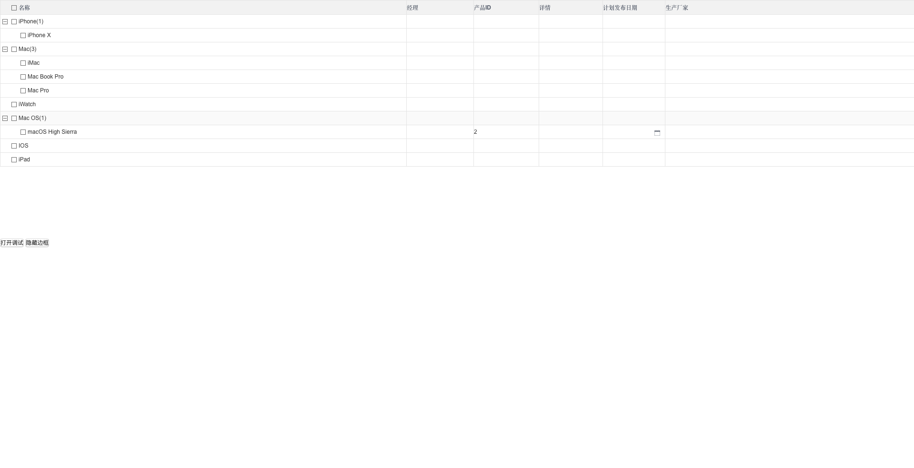

### 预览

[查看Demo演示](https://liujiangshan.github.io/LjsTreeTable/docs/)：(api使用静态数据模拟)
## 运行此项目:
##### 1.[安装yarn](https://yarnpkg.com/zh-Hans/docs/install)
##### 2.克隆项目
```bash
git clone https://github.com/LiuJiangshan/LjsTreeTable.git
```
##### 3.进入项目目录
```bash
cd LjsTreeTable
```
##### 4.安装依赖库
```bash
yarn install
```
##### 5.运行项目
```bash
yarn run dev
```
##### 6.打开浏览器访问:[http://localhost:8080](http://localhost:8080)

## 使用组件:
###方法1(cdn引用)
##### 1.在index.html中
```javascript
<script type="application/javascript" src="//liujiangshan.github.io/LjsTreeTable/dist/index.js"></script>
```
#### 2.main.js中
```
Vue.component("LjsTreeTable",LjsTreeTable.default)
```
#### 3.Vue文件中(同方法二中第4步)
###方法2(node_modules引用,太懒没有上传npm)
##### 1.复制该项目dist文件夹至你的项目node_modules文件夹
##### 2.将dist命名为LjsTreeTable
##### 3.在main.js中引入该组件:
```javascript
import LjsTreeTable from 'LjsTreeTable'
...
Vue.component("LjsTreeTable",LjsTreeTable)
...
```
##### 4.vue文件:
```javascript
<template>
  <div>
    <LjsTreeTable :datas="datas" :columns="columns"/>
    ...
  </div>
</template>
<script>
...
</script>
<style>
...
</style>
```
## 编译自己的LjsTreeTable组件
```bash
yarn run build
```
## 编译该项目示例
```bash
yarn run doc
```
