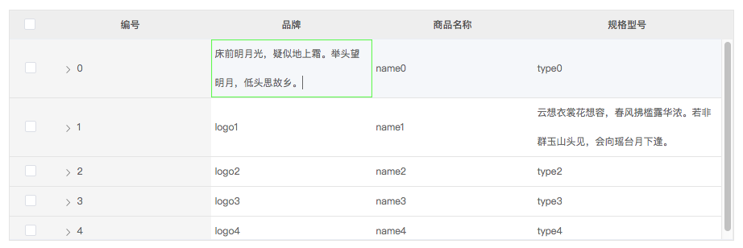

<p align="center">
  <a href="https://circleci.com/gh/LiuJiangshan/ljs-tree-table/tree/element">
    
  </a>
  <a href="https://npmcharts.com/compare/ljs-tree-table?minimal=true">
    
  </a>
  <a href="https://www.npmjs.com/package/ljs-tree-table">
    
  </a>
  <a href="https://www.npmjs.com/package/ljs-tree-table">
    
  </a>
  <br>
</p>

### 预览


### 介绍
基于element-ui中的table组件,扩展了一些功能：键盘焦点控制、双击编辑

### 扩展的属性
#### <a href="https://element.eleme.io/#/zh-CN/component/table">table</a>:

事件:

| 名称        | 介绍                   | 类型                                                         |
| ----------- | ---------------------- | ------------------------------------------------------------ |
| text-change | 单元格数据编辑后的事件 | ( { row, column: { property } }: any, newText: string ) => void |

#### focus-el-table-column(扩展自:el-table-column):

props:

| 名称     | 介绍       | 类型    | 默认  |
| -------- | ---------- | ------- | ----- |
| editable | 是否可编辑 | Boolean | false |


### 安装

```bash
npm install ljs-tree-table
or
yarn add ljs-tree-table

// 模块未编译,vue.config.js中需配置
transpileDependencies: ['ljs-tree-table']
```

### 使用
```bash
详见 src/example/view/baseElement.vue
```
### 运行

| 命令              | 介绍     |
| ----------------- | -------- |
| npm run example   | 运行demo |
| npm build:example | 编译组件 |
